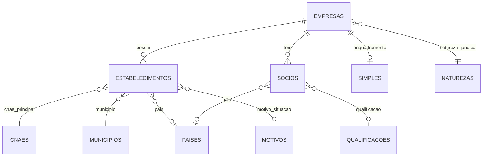

# Modelo dos dados públicos de CNPJ

Fonte de verdade: layout oficial da Receita Federal. Os CSVs são mensais, separados por `;`, codificados em ISO-8859-1 e usam `0`/`00000000` para algumas datas nulas.

## Chaves e cardinalidades

| Tabela | Chave | Relacionamento |
|---|---|---|
| `empresas` | `cnpj_basico` (8 caracteres) | raiz cadastral |
| `estabelecimentos` | `cnpj_basico + cnpj_ordem + cnpj_dv` | N por empresa; matriz e filiais |
| `socios` | ID sintético estável | N por empresa; documento pode estar mascarado/ausente |
| `simples` | `cnpj_basico` | no máximo 1 por empresa |
| dimensões | código oficial | descrições de CNAE, município, natureza, motivo, país e qualificação |

Não se deve forçar integridade referencial completa nas dimensões: a própria série histórica contém códigos antigos. Desde julho de 2026, `cnpj_basico` e `cnpj_ordem` aceitam `A-Z`; apenas o DV continua numérico.

## Distribuição Cloudflare

- **R2 Data Catalog/Iceberg**: conjunto completo e snapshots mensais em Parquet.
- **Basin SQL**: consultas analíticas e junções sobre os ~60 milhões de registros.
- **D1**: catálogo de snapshots, métricas, feedback e índices quentes — não os 85 GB completos.
- **KV**: cache de perguntas normalizadas.
- **Vectorize**: semântica de CNAEs e termos de busca.
- **Queues**: lotes e retomada da importação.

O snapshot só muda para `ready` depois de: schema válido, contagens mínimas, unicidade das chaves e amostras de junção aprovadas.
